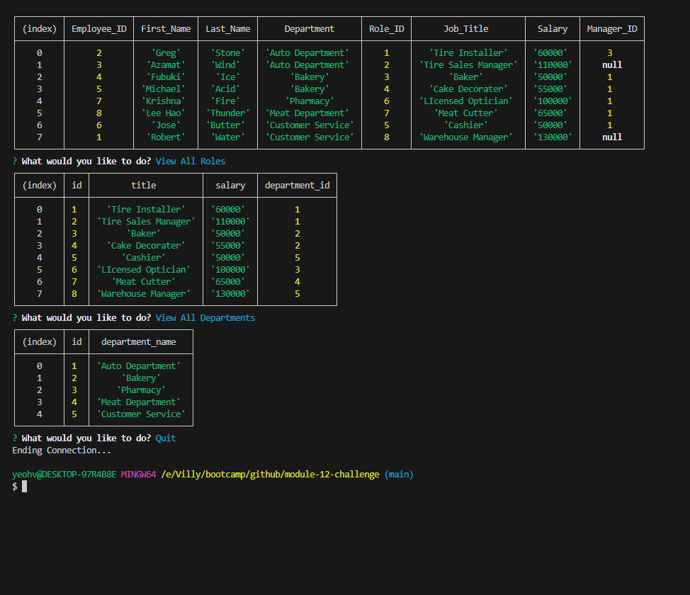

# About
This is Module 11 Challenge by the Ohio State University bootcamp. This project simulates databases companies use to store data about employees, making it easy to access work information about the employees. It will be presented as a table for readability. 

## Description
This program will let the user access the 'employees_db' database through command line using mySQL. The user will receives a prompt to select several options from the list, and each one has a different function. This program will allow you to access the employee data and add more if they want.

## Instruction
To initiate the database, user will have to do a 'npm i' and initiate the program with 'npm start'. They will need to have mySQL installed for the application to work.

## Image of the application

## Link to the walkthrough video
Screencastify link: https://watch.screencastify.com/v/Bu10U74PtDCrCdWajkyK